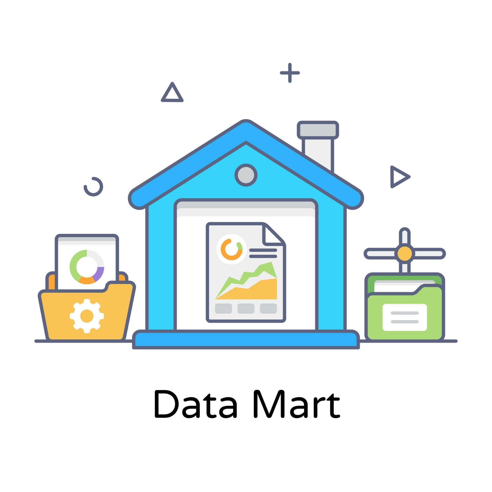
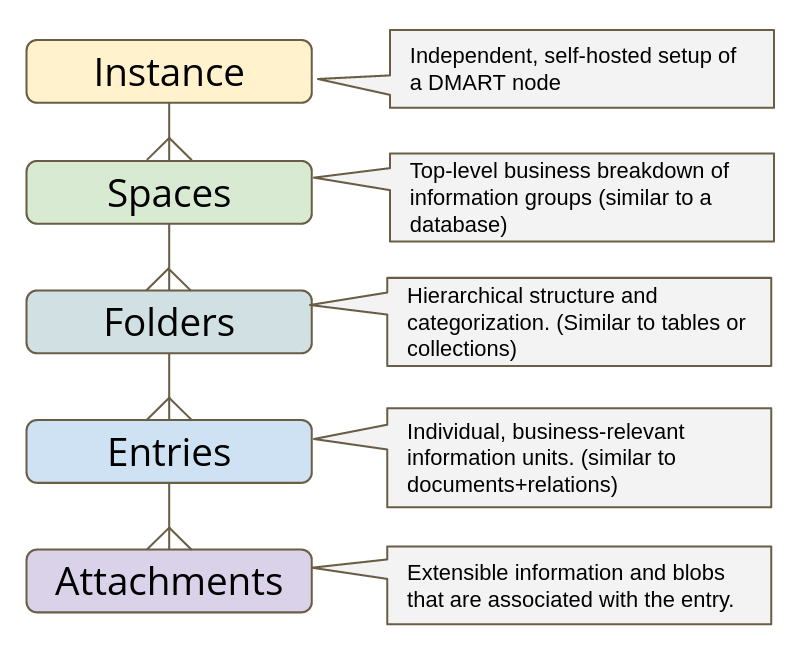
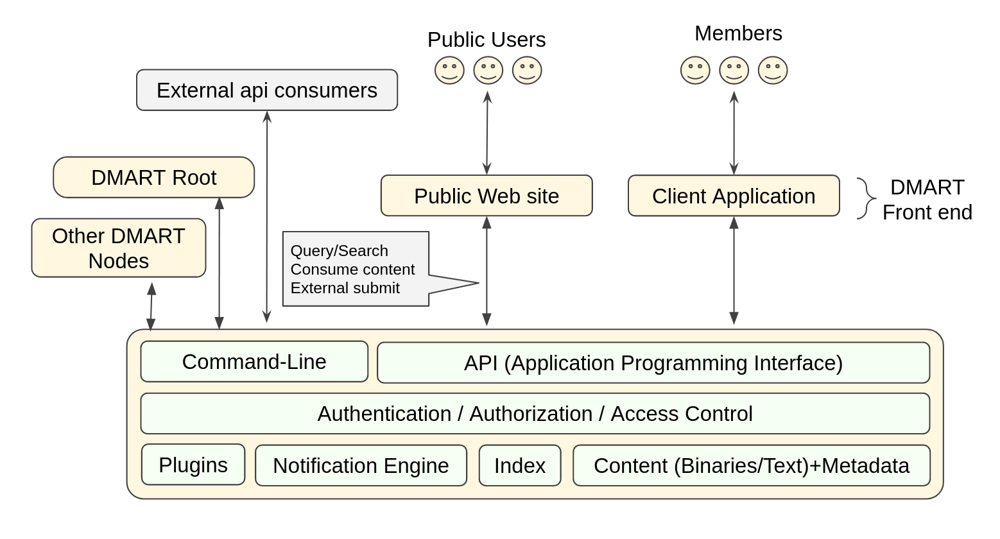
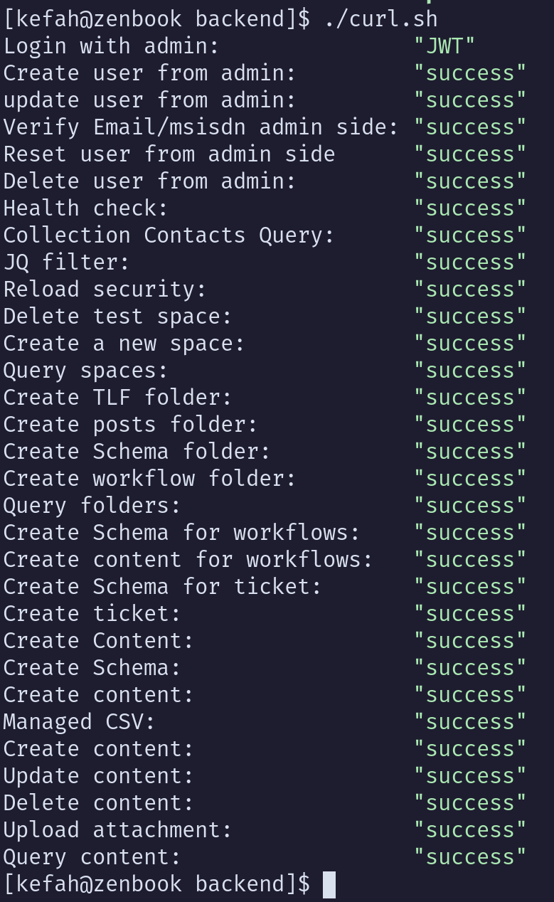
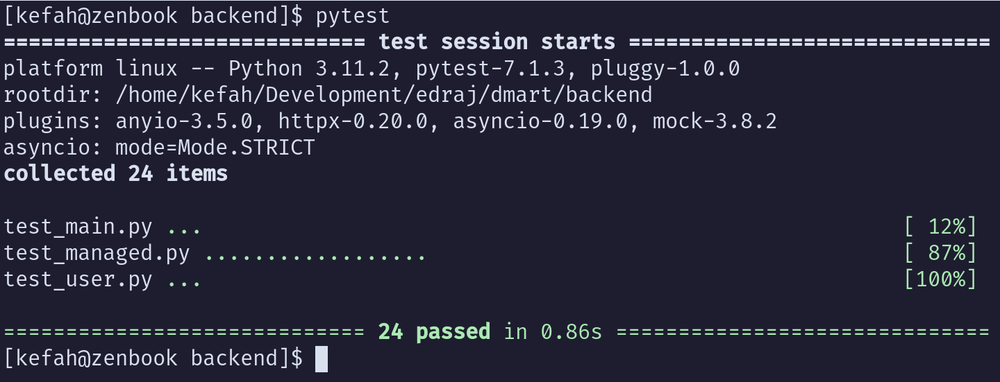
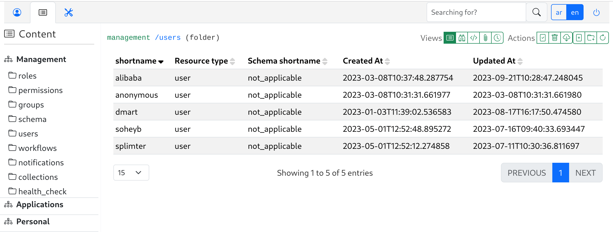
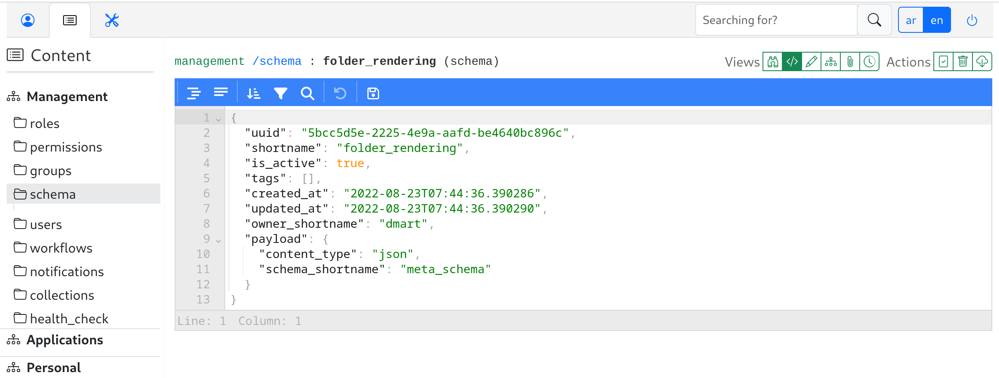
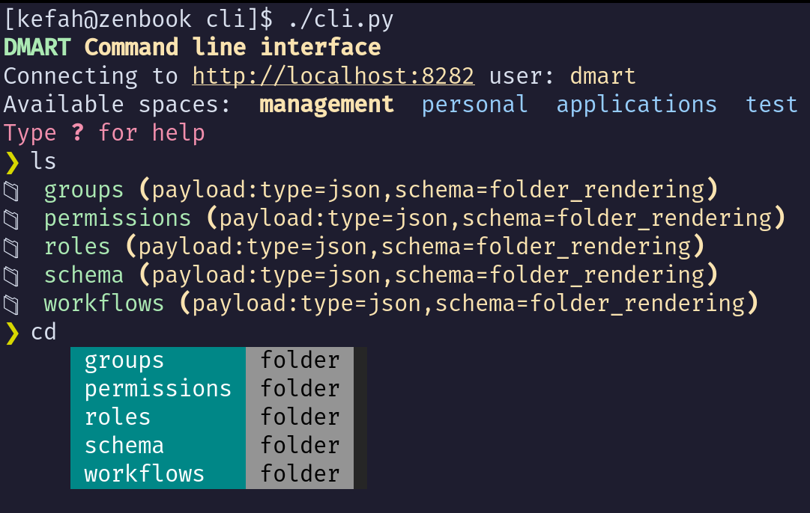

# Data Mart (D-MART)

<!--img src="https://img.shields.io/github/v/release/edraj/dmart.svg" -->

<a href="https://github.com/edraj/dmart/releases/latest">


</a>

<a href="https://github.com/edraj/dmart/releases/latest">

</a>
<br/>
<a href="https://github.com/edraj/dmart/pulse">

</a>

<a href="https://github.com/edraj/dmart/blob/main/LICENSE">

</a>

<a href="https://github.com/edraj/dmart/stargazers">

</a>

<a href="https://github.com/edraj/dmart/issues">

</a>

<a href="https://github.com/edraj/dmart">

</a>

DMART is a data service layer that offers a streamlined / simplified way to develop certain class of solutions with small to medium data footprint (<=300 million primary entries). It is not suited for systems that have large data nor systems that require heavily/complex related data modeling or requiring atomic operations (transactions).

DMART serves as general-purpose, structure-oriented information management system (aka Data-as-a-Service DaaS).

It represents a low-code information inventory platform (aka content registry/repository/vault) that is able to assimilate various types of data (structured, unstructured and binary). It allows you to treat your valuable data assets as commodity; where you can cleanly author, share and extend. Thus, valuable data assets can be maintained as the mastered version and act as the single source of truth.

## The problem DMART attempts to solve

Valuable information (organizational and personal) is getting out of control!

- Dispersed over too many systems, requiring multiple access contexts.
- Difficult to consolidate and link for consumption, insights, reporting and dashboards
- Locked to vendors or application-specific data-formats
- Chaotic and hard to discover / search the data piling up over the years
- Difficult to master, dedup, backup, archive and restore.
- Difficult to protect and secure

## Top highlights ...

- **Data-as-a-Service** : Backbone data store where the data assets get declared and used across multiple applications and microservices. The data assets are declared in the logical and business representation rather than classical RDBMS (physical).
- **Standardized API** : Publicly-accessible unified api layer allowing interaction with the different types of data; and simplifying the work of application developers.
- **Data longevity** : Resilient and time-proof data storage, as data is stored in flat-files directly on the file system. This opens the door for easy access, inspection, validation, backup and change tracking. At any point in time, the redis index can be recreated from the flat-files.
- **User management and access control** : "Batteries included" to elevate the burden from application development.
- **Microservice friendly** : Leveraging JWT shared secret, additional microservices can automatically leverage the user's session with dmart. There is also a compatible FastApi skeleton git repository to facilitate the development of additional microservices.
- **Extensible via plugins** : Specialized logic (plugins) can be added to react to certain types of activities and content.
- **Entry-oriented** : As opposed to document-oriented NoSQL, entry-orientation revolves around consolidating the coherent information unit alongside its belongings (known as "attachments" that can involve textual and/or binary) as one entry.
- **Activities and workflows** : Configurable activity (ticket) and workflow management.
- **Messaging and notifications** : Ability to trigger different types of notifications and ability to store user messages.




## Core concepts

- Each coherent information unit (data asset) is declared as **entry**.
  - An entry includes all related business information (meta, structured, textual and binary) that can be extended / augmented with attachments.
  - Entries are organized within arbitrary category structure (folders)
  - Entries are indexed for fast search and retrieval.
  - Entries can be optionally linked by "weak" links (aka relations).
  - Changes on entries are recorded for audit and tracking.
  - Structured content: Each structured json content (payload) is associated with a pre-defined json schema stored under the schema section in the space.
  - Arbitrary attachments: An entity could have attachments (binary or otherwise)
- Entries are stord and organized arbitrary hierarchical folder structure (aka categories) on the file-system. Facilitating folder-based routes.

DMART is a "Data-first" platform to management your valuable data/information; allowing you to transform your perception of data from liability into assets.



## API layer (REST-like, JSON-API)

  - **Management**  : Create/update/delete schema, content, scripts, triggers, users and roles
  - **Discovery**   : Users, paths, scripts, changes/history, schema and content
  - **Consumption** : Content/attachments, scripts and submissions

Full OpenApi 3 compliant documentation can be found [here](https://api.dmart.cc/docs)

## Architecture and technology stack



  - flat-file data persistence on standard file-system. Using folders, clear and simple json format that is backed by json-schema, text and binary (media/documents) files.
  - Python 3.12 with emphasis on
    - asyncio : maximizing scalability and leverage of server resources and enabling background jobs (post api service time).
    - type hinting and stringent linting (pyright).
  - FastAPI as the api micro-framework (based on our _curated_ fastapi skeleton) and full leverage of Pydantic and OpenApi version 3.
  - Hypercorn (runner server)
  - Redis as the operational data store. With specific leverage of RediSearch RedisJSON modules.
  - Intensive json-based logging for easier insights.

   

## Terminology

| Term | Description |
|----|----|
| **space** | Top-level business category that facilitates grouping of relevant content. Permissions are defined within the space boundaries |
| **subpath** | The path within space that leads to an entry. e.g. `content/stuff/todo` |
| **entry** | The basic unit of coherent information.|
| **shortname** | The unique identifier that differentiates an entry among its siblings (i.e. within a subpath) |
| **meta** | Meta information associated with the entry such as owner, shortname, unique uuid, creation/update timestamp, tags ..etc|
| **schema** | The entry under `schema` subpath providing schema definition that can be referenced by structured content entries or attachments |
| **attachment** | Extra data associated with the entry. An attachment has its own payload |
| **payload** | The actual content associated with the entry or attachment |
| **locator** | A *link* to another entry (within the space or in another space). |
| **.dm** | The hidden folder used to store meta information and attachments and their payload files |
| **permission** | The listing of entitlement tuples: actions, content types and subpaths.
| **role** | The association of a set of permissions to be granted to a user |


## Entry composition

 - A meta-file (json) that holds *meta* information about the entry; such as name, description, tags, attributes ...etc.
 - Within the meta file, each entry should have a globally unique UUID and a shortname that must be unique within the parent folder and across the sibling entries.
 - A payload as a separate file (json, text or binary)
 - Change history on that entry.
 - An entry has an arbitrary number of attachments, each attachment has a meta-file and payload.
   - Alteration: Describing a change
   - Comment
   - Relationship: A pointer to another entry
   - Media: Binary payload such as images, videos ...etc

## File disposition scheme

| File path | Description |
|----|----|
| `[sub/path]/.dm/meta.folder.json` | The meta file of a Folder |
| `[sub/path]/.dm/[entryshortname]/meta.[entrytype].json` | The meta file of a regular entry |
| `[sub/path]/[entrypayload]` | The optional payload file of the entry. it may not clash with another payload file within that folder|
| `[sub/path]/.dm/[entryshortname]/attachments.[attachementtype]/meta.[attachmentshortname].json` | The meta file of an attachment |
| `[sub/path]/.dm/[entryshortname]/attachments.[attachementtype]/[attachmentpayload]` | The optional attachment payload file. it may not clash with meta.[xxx].json or another payload file within that folder|

With this scheme, only proper entry main payload files appear to the user. All meta data and attachments data is stored in the hidden (.dm) folders.


## Installation

### Container (recommended)

Using podman (or docker), dmart can be fully setup and configured in few minutes.

You only need a command line console, git and podman (or docker).

#### Run the container directly from Github image registry


```
# Pull the latest docker image
podman pull ghcr.io/edraj/dmart:latest

# Inistantiate the container and map the https port to localhost
podman run --name dmart -p 4443:4443 -p 8000:8000 -d -it dmart

# Set the admin password
podman exec -it dmart /home/venv/bin/dmart set_password

# Run test to make sure all is good
podman exec -it dmart /home/venv/bin/dmart test

# Open on the browser
https://localhost:4443

```
# Build the container locally

```
# Clone the git repo
git clone https://github.com/edraj/dmart.git
cd dmart/admin_scripts/docker

# Build the container
podman build -t dmart -f Dockerfile

# Run the container
podman run --name dmart -p 4443:443 -d -it dmart

# Set the admin password
podman exec -it -w /home/dmart/backend dmart /home/venv/bin/python3 ./set_admin_passwd.py

# Run the auto tests
podman exec -it -w /home/dmart/backend dmart ./curl.sh

# Open the browser to login to the admin tool and click on login.
# User name: dmart
# Password: The password you entered in the set_admin_passwd step above.
# Url : https://localhost:4443

```

### Manual (for advanced users)
#### Requirements

- git
- jq
- python >= 3.12
- uv
- postgresql
- python venv


### Steps

```bash


# Make logs folder
mkdir logs

git clone https://github.com/edraj/dmart.git

cd dmart

# Copy sample spaces structure
cp -a sample/spaces ../


cd backend

# Create the virtual env
uv env ~/.uvenv

# Activate virtual env
source ~/.uvenv/bin/activate

# Install python modules
uv pip install --user -r requirements.txt

# Optionally, fine-tune your configuration
cp config.env.sample config.env

# Set the admin password
./set_admin_passwd.py

# Start DMART microservice
./main.py


# Optionally: check admin folder for systemd scripts

```

### Data store option

#### SQL mode

- Set `ACTIVE_DATA_DB="sql"` in the config.env file.
- It is **mandatory** to set the required configuration for the SQL database in the config.env file.
```
DATABASE_DRIVER="postgresql"
DATABASE_USERNAME="postgres"
DATABASE_PASSWORD="postgres"
DATABASE_HOST="localhost"
DATABASE_PORT=5432
DATABASE_NAME="dmart"
```
- Media attachments are still being saved in the file system in the specified path that is set in `SPACES_FOLDER`.

#### Automated testing

#### Installing python dependencies

```bash
cd backend
uv pip install --user -r requirements/core.txt  -r requirements/extra.txt  -r requirements/plugins.txt  -r requirements/test.txt
```

#### Running

```bash
cd backend
./curl.sh
python -m pytest
```





#### Using the Admin UI tool

DMART has a comprehensive Admin UI that interacts with the backend entirely via the formal API. It is built with Svelte, Routify3 and SvelteStrap.

```bash
cd dmart/frontend
yarn install

# Configure the dmart server backend url in src/config.ts

# To run in Development mode
yarn dev

# To build and run in production / static file serving mode (i.e. w/o nodejs) using Caddy
yarn build
caddy run
```

### Building tauri binary (Linux AppImage)

This allows packaging the admin tool as a desktop application.

```
# Regular build without inspection
yarn tauri build --bundles appimage

# To add inspection (right mouse click -> inspect)
yarn tauri build --bundles appimage --debug

```




### Using the command line tool

DMART comes with a command line tool that can run from anywhere. It communicates with DMART over the api.

```bash
cd cli

# Create config.ini with proper access details (url, credentials ...etc)
cp config.ini.sample cli.ini

# Install additional packages
uv pip install --user  -r requirements.txt

# Start the cli tool
./cli.py
```



### Offline (aka airgapped) deployment

```bash
# On the "online" computer
rmdir ~/.pipi
rmdir ~/.venv
virtualenv --python=/usr/bin/python3 ~/.venv # or your favorate py env virtualization tool
source ~/.venv/bin/activate
mkdir ~/.pipi
# under dmart/backend
pip download -d ~/.pipi/ $(cat *requirements.txt) virtualenv pip
rsync -av ~/.pipi/ TARGET_OFFLINE_SERVER:~/.pipi

# On the "offline" target server
rmdir ~/.pipi
rmdir ~/.venv
pip install --no-index --find-links=~/.pipi virtualenv
virtualenv ~/.venv # or your favorate py env virtualization tool
source ~/.venv/bin/activate
pip install --no-index --find-links=~/.pipi --upgrade pip
pip install --no-index --find-links=~/.pipi -r requirements.txt -r test-requirements.txt -r plugins-requirements.txt
```


### Running extra python checks

```bash
cd backend
ruff check .
mypy --explicit-package-bases --warn-return-any .

```

### Sample usecases

DMART is a low-level general-purpose data platform. Hence it could apply to a reasonably wide variety of usecases.

The one usecase we are currently focused on building is a universal online presence platform. A tool that combines CMS, Messaging, and Collaboration in a federated fashion (borrowing from how email federates its messaging service)

Simply put, this will help small teams, individuals and interest groups to quickly launch a website (that is their own) index-able by search engines, provision users and allow all to author and interact with content (both from the website and mobile app). With the leverage of DMART all information elements are structures as entries within the specific hierarchy desired by the admin user.

[High-level description](docs/universal_presence_platform.md)

* Sample webapp (Svelte4, Routify3, Sveltestrap)
* Sample mobile app (Flutter)

> [!NOTE]
> Comiong soon.
