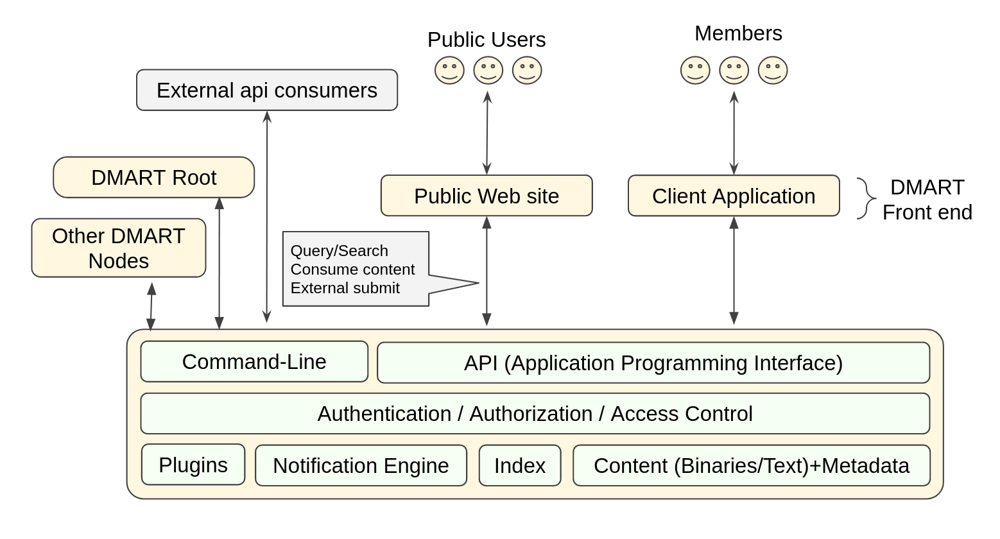
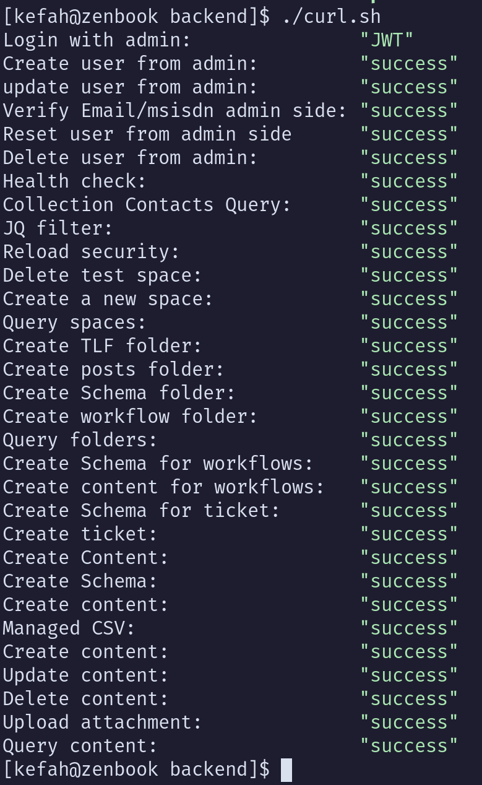
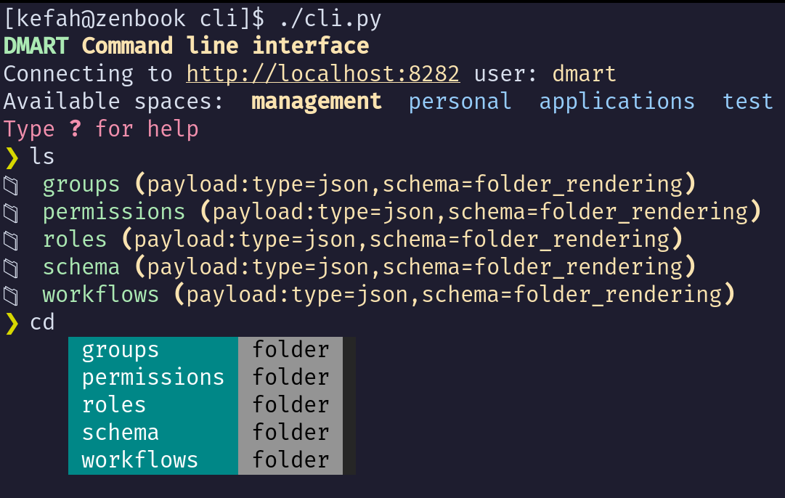

# Data Mart (D-MART)

DMART is a data service layer that offers a streamlined / simplified way to develop certain class of solutions with small to medium data footprint (<=300 million primary entries). DMART is not a one-solution fit-all kind of technology, but it tries to address a wide variety of needs. Specifically, DMART is not suited for systems that have large data (> 400 million primary entries) nor systems that require heavily/complex related data modeling.

As such, DMART serves as general-purpose, structure-oriented information management system (aka Data-as-a-Service DaaS). 

It represents a low-code information inventory platform (aka content registry/repository) that is able to assimilate various types of data (structured, unstructured and binary). It allows you to treat your valuable data assets as commodity; where you can cleanly author, share and extend. Thus, valuable data assets can be maintained as the mastered version and act as the single source of truth. 

## The problem DMART attempts to solve

Valuable information (organizational and individual) is getting out of control!

- Information is dispersed over too many systems, requiring multiple access contexts.
- Difficult to consolidate and link for consumption, insights, reporting and dashboards
- Locked to vendors or application-specific data-formats
- Chaotic and hard to discover / search the data piling up over the years
- Difficult to master, dedup, backup, archive and restore.
- Difficult to protect and secure

## Top highlights ...

- **Data-as-a-Service** : Backbone data store where the data assets get declared and used across multiple applications and microservices. The data assets are declared in the logical and business representation rather than classical RDBMS (physical).
- **Standardized API** : Publicly-accessible unified api layer allowing interaction with the different types of data; and simplifying the work of application developers.
- **Data longevity** : Resilient and time-proof data storage, as data is stored in flat-files directly on the file system. This opens the door for easy access, inspection, validation, backup and change tracking. At any point in time, the redis index can be recreated from the flat-files.
- **User management and access control** : "Batteries included" to elevate the burden from application development. 
- **Microservice friendly** : Leveraging JWT shared secret, additional microservices can automatically leverage the user's session with dmart. There is also a compatible FastApi skeleton git repository to facilitate the development of additional microservices.
- **Extensible via plugins** : Specialized logic (plugins) can be added to react to certain types of activities and content.
- **Entry-oriented** : As opposed to document-oriented NoSQL, entry-orientation revolves around consolidating the coherent information unit alongside its belongings (known as "attachments" that can involve textual and/or binary) as one entry. 


## Core concepts

- Each coherent information unit (data asset) is declared as **entry**. 
  - An entry includes all related business information (meta, structured, textual and binary) that can be extended / augmented with attachments.
  - Entries are organized within arbitrary category structure (folders) 
  - Entries are indexed for fast search and retrieval.
  - Entries can be optionally linked by "weak" links (aka relations).
  - Changes on entries are recorded for audit and tracking.
  - Structured content: Each structured json content (payload) is associated with a pre-defined json schema stored under the schema section in the space. 
  - Arbitrary attachments: An entity could have attachments (binary or otherwise)
- Entries are stord and orgazined arbitrary hierarchical folder structure (aka categories) on the file-system. Facilitating folder-based routes.


## API layer (REST-like, JSON-API)

  - **Management**  : Create/update/delete schema, content, scripts, triggers, users and roles
  - **Discovery**   : Users, paths, scripts, changes/history, schema and content
  - **Consumption** : Content/attachments, scripts and submissions  

Full OpenApi 3 compliant documentation can be found [here](https://dmart.cc/docs)

## Architecture and technology stack

 

  - flat-file data persistence on standard file-system. Using folders, clear and simple json format that is backed by json-schema, text and binary (media/documents) files. 
  - Python 3.11 with emphasis on asyncio and type hinting
  - FastAPI as the api micro-framework (based on our _curated_ fastapi skeleton) and full leverage of Pydantic and OpenApi version 3. 
  - Hypercorn (runner server)
  - Redis as the operational data store. With sepecific leverage of RediSearch RedisJSON modules.
  - Intensive json-based logging for easier insights.  

   

## Terminology 

| Term | Description |
|----|----|
| **space** | Top-level business category that facilitates grouping of relevant content. Permissions are defined within the space boundaries | 
| **subpath** | The path within space that leads to an entry. e.g. `content/stuff/todo` |
| **entry** | The basic unit of coherent information.|
| **shortname** | The unique identifier that differentiates an entry among its siblings (i.e. within a subpath) |
| **meta** | Meta information associated with the entry such as owner, shortname, unique uuid, creation/update timestamp, tags ..etc|
| **schema** | The entry under `schema` subpath providing schema definition that can be referenced by structured content entries or attachments |
| **attachment** | Extra data associated with the entry. An attachment has its own payload |
| **payload** | The actual content associated with the entry or attachment |
| **locator** | A *link* to another entry (within the space or in another space). |
| **.dm** | The hidden folder used to store meta information and attachments and their payload files |
| **permission** | The listing of entitlement tuples: actions, content types and subpaths.
| **role** | The association of a set of permissions to be granted to a user |


## Entry composition

 - A meta-file (json) that holds *meta* information about the entry; such as name, description, tags, attributes ...etc. 
 - Within the meta file, each entry should have a globally unique UUID and a shortname that must be unique within the parent folder and across the sibling entries.
 - A payload as a separate file (json, text or binary)
 - Change history on that entry.
 - An entry has an arbitrary number of attachments, each attachment has a meta-file and payload. 
   - Alteration: Describing a change
   - Comment 
   - Relationship: A pointer to another entry
   - Media: Binary payload such as images, videos ...etc

## File disposition scheme

| File path | Description |
|----|----|
| `[sub/path]/.dm/meta.folder.json` | The meta file of a Folder |
| `[sub/path]/.dm/[entryshortname]/meta.[entrytype].json` | The meta file of a regular entry |
| `[sub/path]/[entrypayload]` | The optional payload file of the entry. it may not clash with another payload file within that folder|
| `[sub/path]/.dm/[entryshortname]/attachments.[attachementtype]/meta.[attachmentshortname].json` | The meta file of an attachment |
| `[sub/path]/.dm/[entryshortname]/attachments.[attachementtype]/[attachmentpayload]` | The optional attachment payload file. it may not clash with meta.[xxx].json or another payload file within that folder|

With this scheme, only proper entry main payload files appear to the user. All meta data and attachments data is stored in the hidden (.dm) folders.


## Installation

### Requirements 

#### Requirements

- git
- jq
- python >= 3.11
- pip
- redis >= 7
- RedisJSON (rejson) >= 2.4
- RediSearch >= 2.6


### Steps 

```bash
git clone https://github.com/edraj/dmart.git

cd dmart 

# Make logs folder
mkdir logs

# Copy sample spaces structure
cp sample/spaces ../


cd backend

# Install python modules
pip install --user -r requirements.txt

# Optionally, fine-tune your configuration
cp config.env.sample config.env

# Start DMART microservice
./main.py


# Optionally: check admin folder for systemd scripts

```

### Automated testing

#### Installing python dependencies

```bash
pip install --user -r test-requirements.txt
```

#### Running

```bash
cd backend
./curl.sh
pytest
```




### Using the command line tool

DMART comes with a command line tool that can run from anywhere. It communicates with DMART over the api.

```bash
cd cli

# Create config.ini with proper access details (url, credentials ...etc)
cp config.ini.sample config.ini

# Install additional packages
pip install --user  -r requirements.txt

# Start the cli tool
./cli.py
```




## Coming soon ...


### Mobile app skeleton (based on SvelteNative and NativeScript)

### Web app skeleton (based on Svelte)

